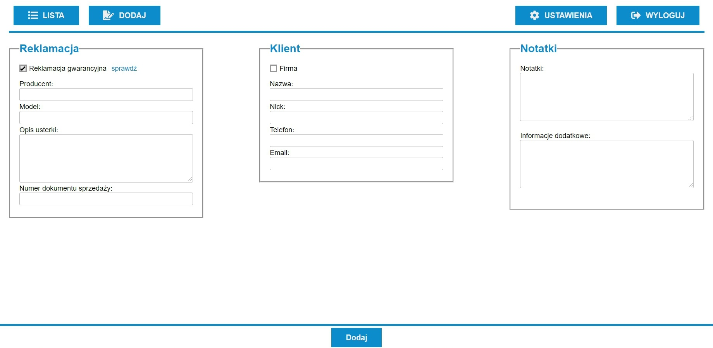

# Reclamations
[live](mb2-reclamations.netlify.app)
user: test@test.pl
password: test123

## Screenshots
Authentication:

List:

Adding:

Details with editing:

Column settings:

## Technologies
* HTML
* CSS
* JS
* React with router

## Features
* Authorization
* Synchronization with firebase
* Addition
* Edition
* Validation of forms
* Displaying the complaint list
* Sorting data in a table
* Filtration
* Checking if the item is still covered by the guarantee or the time has passed
* Column visibility settings (saving in localstorage)

## Built with
* firebase
* fontawesome
* uuid

## Setup
After you clone this repo to your desktop, go to its root directory and run npm install to install its dependencies.

Once the dependencies are installed, you can run npm start to start the application. You will then be able to access it at localhost:3000

## License
[MIT](https://choosealicense.com/licenses/mit/)
